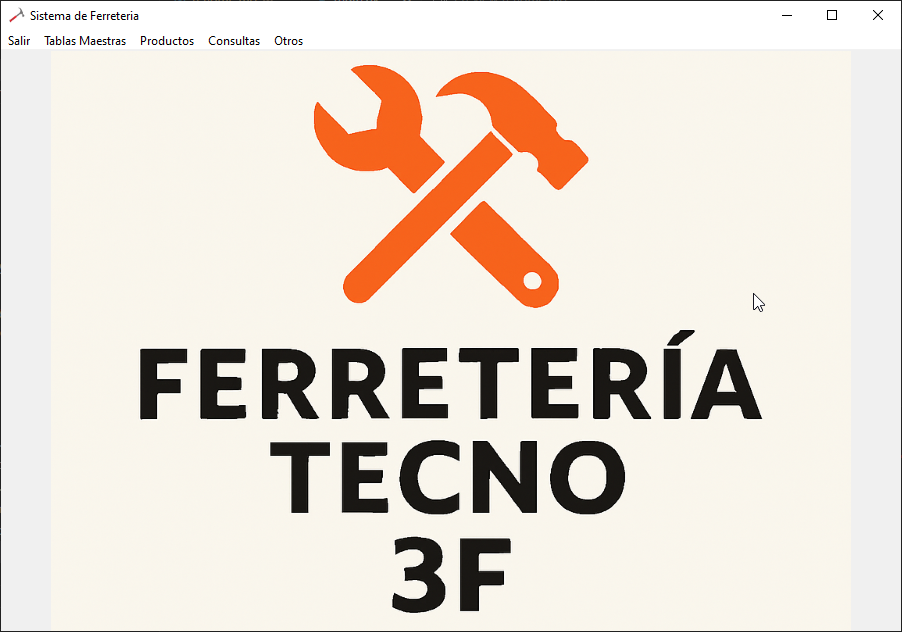
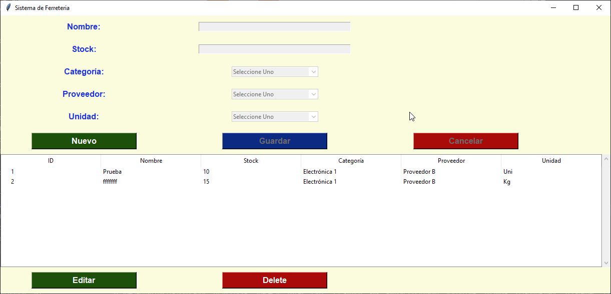
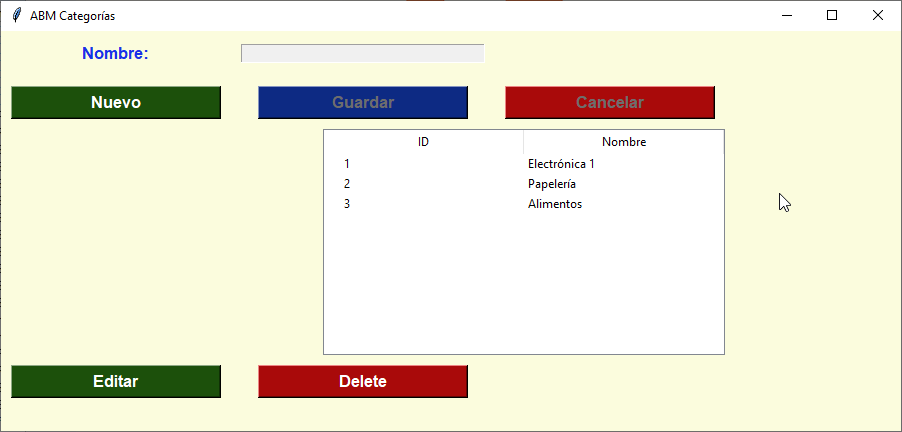
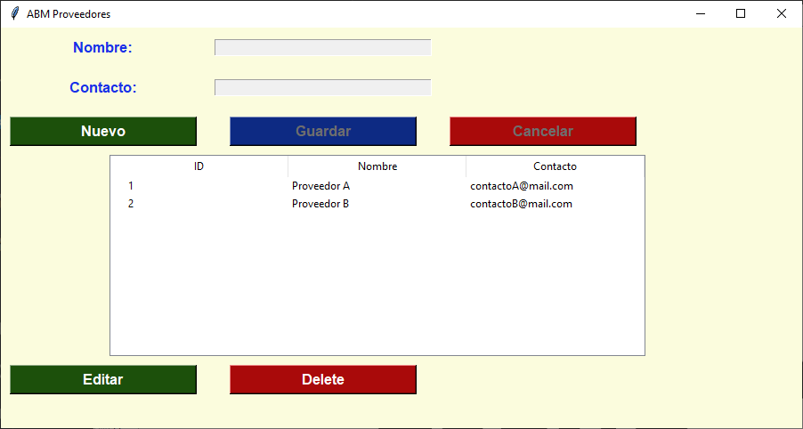
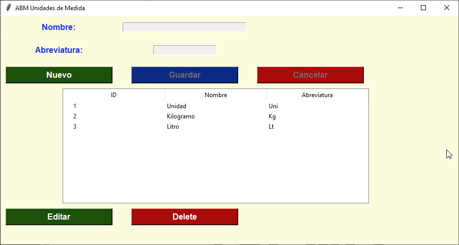
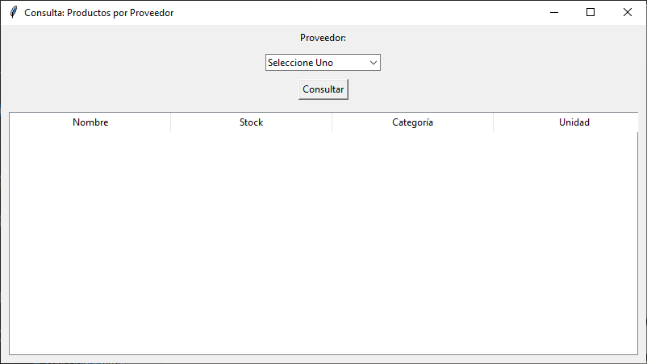
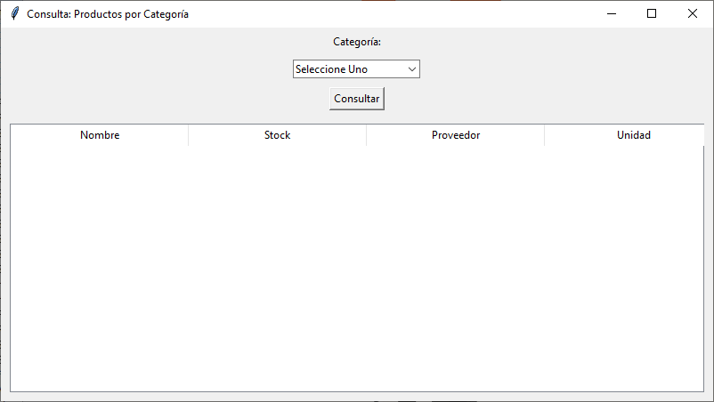
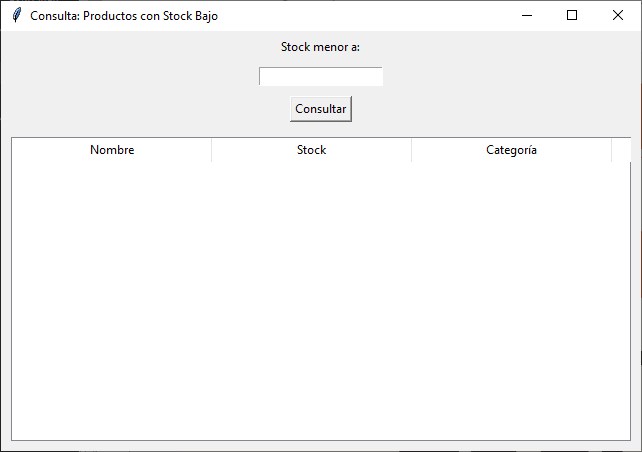

# TECNO 3F - CURSO PYTHON INTERMEDIO  
# AÑO 2025  
# DOCENTE: GABRIEL SEBASTIÁN ROMAN  

## ALUMNO: LUIS OMAR SPECTERMAN  
## DNI: 14.620.696  
## TP - ENTREGA FINAL  

---

## 📌 Consigna
Deberán crear un CRUD sobre cualquier temática que cumpla con lo siguiente:

- Interfaz gráfica (Tkinter, ttkthemes, Kivy, PyQt, etc.).  
- Mínimo 3 tablas relacionadas (SQLite).  
  > La tabla intermedia **no** cuenta como tercera tabla.  
- Contener, en general, mínimo 5 campos de entrada (Input, Select, Check, etc.).

---

# 🛠️ Sistema de Ferretería   

Proyecto realizado en Python utilizando **Tkinter** y **SQLite**.  
Permite administrar productos y tablas maestras (categorías, proveedores y unidades de medida), además de realizar consultas específicas desde un menú principal.

---

## 📂 Estructura de directorios


```
│ 
├── ddbb/ 
├──── ferreteria.db  # Base de datos Sqlite 
│ 
├── img
│ 
├──── imagen_logo.png   Imagen fondo de pantalla menu principal
├──── martillo.ico      Icono de la aplicacion
│
├────── capturas/ 
│ 
├── include
│ 
├──── menu.py         # Menú principal (Inicio, Tablas Maestras, Productos, Consultas, Otros) 
│
├── modelo/  
│
├──── coneciondb.py     # Clase Conneccion: maneja conexión a la base de datos SQLite 
│ 
├──── productos_dao.py  # CRUD y clase Producto 
│ 
├──── categorias_dao.py # CRUD y clase Categoria 
│ 
├──── proveedores_dao.py # CRUD y clase Proveedor 
│ 
├──── unidades_dao.py    # CRUD y clase Unidad 
│ 
├── vista/ 
│ 
├──── productos_frame.py   # Frame ABM Productos
│ 
├──── categorias_frame.py  # Frame ABM Categorías 
│ 
├──── proveedores_frame.py # Frame ABM Proveedores 
│ 
├──── unidades_frame.py    # Frame ABM Unidades de Medida 
│ 
├──── consultas_frame.py   # Frame Consultas (por categoría, proveedor, unidad, stock bajo) 
│                                              
├── main.py    # Punto de entrada: inicializa la aplicación y abre el menú principal 
└── README.md # Documentación del proyecto
```

---

## 📌 Descripción breve de cada archivo

### Carpeta `ddbb/`
- **ferreteria.db** → Base de Datos SQLite.  

### Carpeta `img/`
- **imagen_logo.png** → Imagen fondo del frame principal
- **martillo.ico**    → Imagen icono de la aplicacion

### Carpeta `img/capturas`
- Capturas varias de las pantallas del sistema

### Carpeta `include/`
- **menu.py** → Barra de menú principal con opciones para abrir los distintos frames.  
 
### Carpeta `modelo/`
- **coneciondb.py**      → Clase `Conneccion` para abrir/cerrar conexión a SQLite.  
- **productos_dao.py**   → Clase `Producto`   y funciones CRUD para la tabla `Productos`.  
- **categorias_dao.py**  → Clase `Categoria`  y funciones CRUD para la tabla `Categorias`.  
- **proveedores_dao.py** → Clase `Proveedor`  y funciones CRUD para la tabla `Proveedores`.  
- **unidades_dao.py**    → Clase `Unidad`     y funciones CRUD para la tabla `UnidadesMedida`.  

### Carpeta `vista/`
- **productos_frame.py**   → Ventana ABM de productos 
- **categorias_frame.py**  → Ventana ABM de categorías.  
- **proveedores_frame.py** → Ventana ABM de proveedores.  
- **unidades_frame.py**    → Ventana ABM de unidades de medida.  
- **consultas_frame.py**   → Ventanas de consultas: por categoría, proveedor y stock bajo limite.  

### Raíz
- **main.py** → Archivo principal que arranca la aplicación y carga el menú.  
- **README.md** → Este documento con la estructura y explicación del proyecto.  

---

## 🚀 Cómo ejecutar
1. Clonar o descargar el proyecto.  
2. Ejecutar `main.py` con Python 3:  
   ```bash
   python main.py 


# Estructura de la base de datos **ferreteria**

    
        CREATE TABLE IF NOT EXISTS Categorias(
            ID INTEGER PRIMARY KEY AUTOINCREMENT,
            Nombre TEXT NOT NULL,
            Descripcion TEXT
        );

        CREATE TABLE IF NOT EXISTS Proveedores(
            ID INTEGER PRIMARY KEY AUTOINCREMENT,
            Nombre TEXT NOT NULL,
            Contacto TEXT
        );

        CREATE TABLE IF NOT EXISTS UnidadesMedida(
            ID INTEGER PRIMARY KEY AUTOINCREMENT,
            Nombre TEXT NOT NULL,
            Abreviatura TEXT NOT NULL
        );

        CREATE TABLE IF NOT EXISTS Productos(
            ID INTEGER PRIMARY KEY AUTOINCREMENT,
            Nombre TEXT NOT NULL,
            Stock INTEGER NOT NULL,
            Categoria INTEGER,
            Proveedor INTEGER,
            Unidad INTEGER,
            FOREIGN KEY (Categoria) REFERENCES Categorias(ID),
            FOREIGN KEY (Proveedor) REFERENCES Proveedores(ID),
            FOREIGN KEY (Unidad) REFERENCES UnidadesMedida(ID)
        );


# Pantallas Principales del Sistema


# 📷 Capturas de pantalla

## 🖥️ Pantalla principal


## 🧰 ABM Productos


## 🗂️ ABM Categorías


## 🏷️ ABM Proveedores


## 📏 ABM Unidades de Medida


## 🔎 Consultas
# Por Seleccion Proveedor


# Por Seleccion Categoria


# Por Bajo Stock 

